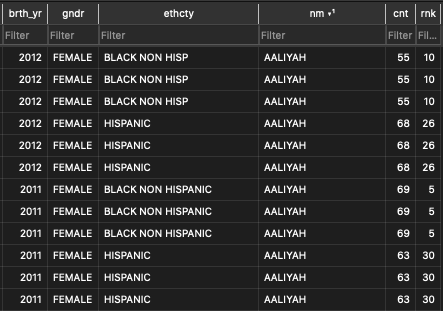
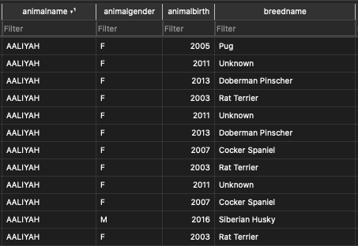
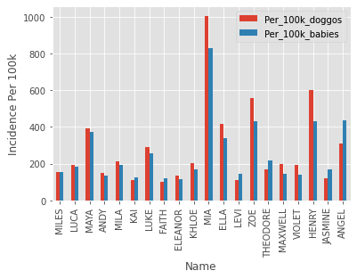
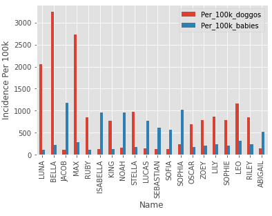

# Babies vs Doggos
## ETL Project
DU Data Bootcamp Dec 2020

Group members:
- Sarah Heavner
- Stu Yates
- Tempest Campbell

## Overview

For this project, we took 2 datasets from the City of New York. One is a list of baby names, with the number of times they appeared on birth certificates in NYC for each year between 2011 and 2016. The other is a list of every doggo license issued in NYC between 2014 and 2018, with the dog's name and birth year.

The question we attempted to answer is: What names are similarly popular for babies and doggos? To accomplish this, we extracted each dataset into a SQLite database, transformed them into a clean, harmonized, and unified table, and loaded the result into a static CSV file.

## Extract

The City of New York provides a number of ways to export their data, but downloading a CSV seemed too rudimentary, so we went with their Socrata API. We registered and obtained an app token, then passed that into the Socrata client constructor (via the sodapy package) along with the registration email and password. (We of course stored these as environment variables in a config file that was gitignored, so you won't find them in the repo.)

Next, we used SQLAlchemy to create classes for each dataset. We then looped over each item in the returned JSON object and added it to the session, and finally committed the session to a local, static SQLite database. There was some transformation involved to handle JSON objects that were missing fields, but other than that this was purely an extract step. 

## Transform

For the transform step, we used Jupyter Notebook and SQLAlchemy to open up the SQLite file, then used Pandas to do the majority of the transformation.

### Babies

[Source Data](https://data.cityofnewyork.us/Health/Popular-Baby-Names/25th-nujf)

Obviously, HIPAA prevents organizations from releasing lists of data about specific babies, so each row is a name, not an individual baby, with the counts for that name by ethnicity, gender, and birth year:

We weren't concerned with ethnicity or gender, although that could be something to look at. We also didn't care so much about birth year, just the range of years, so we grouped the babies by name summed the counts.

Some issues with this dataset were:

- Many duplicates and triplicates. Out of around 27k rows, only a little over 12k were unique.
- Inconsistencies. We didn't end up looking at ethnicity, but we did do some cleaning up to harmonize "BLACK NON HISP" and "BLACK NON HISPANIC", as well as other inconsistencies like capitalization and entry errors.

### Doggos

[Source Data](https://data.cityofnewyork.us/Health/NYC-Dog-Licensing-Dataset/nu7n-tubp)

Dogs have no constitutional right to privacy, so each dog gets its own row. (More accurately, each registration gets its own row, but if you only looka registrations for a single year, it ends up being the same thing.) There's quite a few columns, like the breed and zip code, that could both make for some interesting analyses of their own, but weren't relevant to our central thesis. But like the babies, we have name and birth year:

So we took registrations from the 2018 "extract year" and filtered for dogs born between 2011 and 2016 to match the babies dataset, then got the counts for each name.

Some issues with this dataset were:

- Many duplicates. However, this was mainly because it's actually several datasets ("extract years") combined into one, which was easy to filter out.
- Plentiful entry errors. Some names were just numbers or dates, some were 1, 2 or 3 hyphens, some were datetimes.
- Missing values in the JSON. Specifically, many objects returned were missing gender, which required some cleaning in the Extract phase.
- Inconsistencies. Capitalization varied frequently between title and uppercase. Many names had multiple variations in punctuation, like "Peekaboo" and "Peek-a-Boo", so we used some RegEx to remove punctuation altogether.

### Joining

Lastly, we merged the datasets on name into a DataFrame. We added columns to calculate frequency per 100k of each species, then established a semi-arbitrary cutoff to only look at names with at least 100 per 100k for both. We then added another column to calculate percent difference between those 2 columns and sorted by percent difference.

### Analysis

We then used Matplotlib (or more accurately, the Pandas Plotting implementation of Matplotlib) to create bar charts of the 20 names with the lowest percent difference:

As you can see, Mia is fairly popular in New York City as a name for either a baby or a dog. (If that's your name, please don't take it personnaly.)

Conversely, we thought we'd do a descending sort of percent difference to get the names that were least likely to be both a baby and a dog name:

Even relatively benign human names like Oscar and Max are much more popular for dogs than babies. The name Bella is much more popluar for dogs, but its longer form Isabella is much more popular for babies. We were also curious about how pop culture affected baby and dog names during the timeframe, so one thing that stood out is that Bella, the human heroine of the Twilight saga, was much more prevalent as a dog name, whereas Jacob, her werewolf secondary love interest, was much more popular for babies.

## Load

Because the final dataset was less than 1000 rows, we exported it to a CSV and called it a day.

## Conclusions

Even pretty good datasets require some cleaning and untangling before you can make use of them. Although the City of New York does a good job of making records available, they still throw you a lot of curveballs. But with the tools we've learned in this bootcamp, were were able to easily pinpoint those issues and clean them up with a few lines of code here and there.